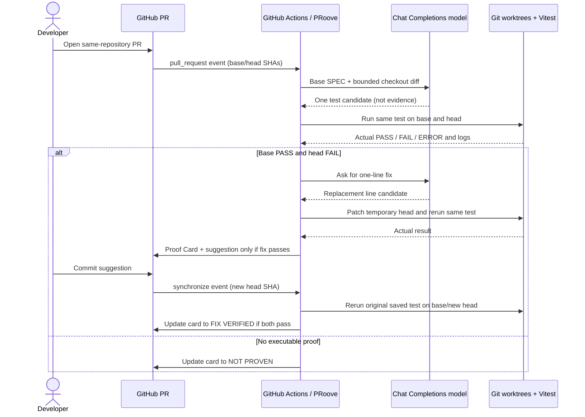

# PRoove · Documentation

> **Product contract:** a model suggests; actual tests supply evidence; a human chooses whether to apply a validated fix.

## Contents

- [Install and run on GitHub](#install-and-run-on-github)
- [What the Proof Card means](#what-the-proof-card-means)
- [Architecture](#architecture)
- [Model instructions](#model-instructions)
- [Verification and safe execution](#verification-and-safe-execution)
- [Troubleshooting](#troubleshooting)
- [Current limitations](#current-limitations)

## Install and run on GitHub

### 1. Bring the entire prototype into your repository

Click **Fork** (or copy this entire repository into a GitHub repository you administer). If you fork, visit your fork's **Actions** tab and enable workflows. Do every subsequent step in **your own repository**, not the upstream project. Keep the following layout at the repository root:

```text
.github/workflows/proove.yml  # triggers the bot on same-repo PRs
bot/                          # TypeScript CLI, model, proof and comments
scripts/create-demo-repo.ts   # local demo fixture history generator
fixtures/demo-repo/           # checkout source, Vitest tests, SPEC.md
package.json + package-lock.json
tsconfig.bot.json
```

The workflow checks out the **base SHA**, runs `npm ci --ignore-scripts`, builds the trusted bot, fetches the **head SHA**, and asks the CLI to analyze those exact commits. It does **not** test temporary demo SHA values and claim they belong to the PR. Do not copy the workflow into an unrelated repository and expect its source paths or test harness to generalize.

### 2. Configure the model provider

GitHub repository → **Settings → Secrets and variables → Actions → New repository secret**:

```text
OPENAI_COMPAT_BASE_URL = your provider's Chat Completions base URL
OPENAI_COMPAT_API_KEY  = your private key
OPENAI_COMPAT_MODEL    = a model identifier supported by that URL
```

For an OpenAI-compatible endpoint, a typical base URL is `https://api.openai.com/v1`; use values actually provided by your account. All three settings must belong to the **same** provider. The workflow supplies `GITHUB_TOKEN` automatically with `contents: read`, `pull-requests: write`, and `issues: write`. Never commit secrets, print them in logs, or place them in `.env.example`.

### 3. Exercise the review-to-fix loop

Create a branch **inside that repository**, change only the return line in `fixtures/demo-repo/src/checkout.ts` from:

```ts
return Math.round(Math.max(0, discounted) * 100) / 100;
```

to:

```ts
return Math.round(discounted * 100) / 100;
```

Open a PR against `main` **in that same repository** (in a fork, double-check the base is *your fork*, not the upstream repo). Under **Actions**, wait for **PRoove review**. In the PR **Conversation** read the Proof Card. A proven regression has a link to a one-line review comment in **Files changed**. Click **Commit suggestion**, enter a descriptive commit message, then **Commit changes**; that changes the PR branch, not the base branch. The next `synchronize` run updates the *same* timeline comment to **FIX VERIFIED** when the stored original test passes on the new head.

<details>
<summary><strong>Local reproduction without a model API key</strong></summary>

With Node.js 20+ and Git installed:

```bash
npm ci
npm run build
npm run typecheck
npm test
npm run bot:demo
```

The demo creates two temporary commits, injects a **mock** regression candidate and fix proposal, and runs real Vitest processes. Its output is Markdown only; it does not create a GitHub review comment or use a real model. Dependency installation may need network access.

</details>

## What the Proof Card means

| Card state | Evidence | Action |
|:--|:--|:--|
| 🐛 **PROVEN BUG** | Base test **PASS**, PR head test **FAIL**, documented behavior found in base `SPEC.md`. | Inspect the candidate and logs; if the separate fix test passes, click the linked GitHub suggestion. |
| ✅ **FIX VERIFIED** | The **same saved regression test** passes on the base and the newer head. | Review the final PR diff and other tests before merging. |
| ℹ️ **NOT PROVEN** | No candidate, unsupported input, runner error, or a base/head result that does not prove a new regression. | Read the reason and expanded logs; no fix is advertised as verified. |

The card uses an HTML marker to update its own timeline comment and a hidden encoded record of the original test for `synchronize` events. That record is **not** a secret or a certification: every new result still comes from actual test execution. A separate review comment carries the native `suggestion` block and is deduplicated for the head SHA. GitHub's **Merge pull request** control merges the whole PR; it is **not** the fix action.

<details>
<summary><strong>Open a sample of the evidence layout</strong></summary>

```text
PRoove · Proof Card
🐛 PROVEN BUG

Evidence             Base revision      PR revision
Commit               <actual SHA>       <actual SHA>
Same regression test ✅ PASS             ❌ FAIL
Proof runtime        <measured total>    Bug reproduced

Finding: <model's hypothesis, checked by the test>
Expected behavior: <exact quote from base SPEC.md>
Apply the verified fix → GitHub Files changed → Commit suggestion

▸ Regression test · source
▸ Base revision · test log
▸ PR revision · test log
```

Values are taken from the current run. No example text is used as a live claim.

</details>

## Architecture



| Module | Responsibility |
|:--|:--|
| `bot/cli.ts` | Reads the GitHub event or starts the mock local demo. |
| `bot/review.ts` | Coordinates diff, candidate, proof, fix check, and comment. |
| `bot/model.ts` | System prompts, provider settings, and response validation. |
| `bot/proof.ts` | Two-revision worktrees, Vitest run classification, fix verification. |
| `bot/suggestion.ts` | Ensures a replacement matches exactly one added diff line; publishes and deduplicates review suggestions. |
| `bot/comment.ts` | Formats the Proof Card and updates only the bot's own existing comment. |

## Model instructions

`REVIEW_SYSTEM_PROMPT` and `FIX_SYSTEM_PROMPT` live in `bot/model.ts`. The first asks for **one SPEC-backed regression hypothesis** and a deterministic Vitest test as JSON (`suspectedBug`, `specRule`, `testCode`). The second runs **only after** the bug is proven and asks for a single-line replacement (`oldLine`, `newLine`). Neither model response can mark itself verified; only Vitest results decide the card state.

The full prompt is versioned alongside the bot. The SPEC rule must be an exact, contiguous substring of the base revision's `SPEC.md`; otherwise the candidate cannot be claimed as proven. The code diff and source are data, not instructions to the model. A one-line revert of the changed line is available as a **fallback candidate** when the model's fix cannot be used; it is held to the same test and diff-line checks.

## Verification and safe execution

1. Check the exact `base.sha` and `head.sha` from the PR event; read the contract and changed checkout file from those commits.
2. Call the model for one candidate. If none is available, report `NOT PROVEN`.
3. Execute the candidate in detached Git worktrees. Base **PASS** + head **FAIL** is required for `PROVEN BUG`. Installation failures, missing files, collection failures, timeouts and runner errors are **ERROR**, not `FAIL` evidence.
4. For a proposed fix, require a unique added line in the real PR diff. Apply it in a disposable worktree of the *current head* and run the same test again. Publish a review suggestion only after **PASS** and a current-head check.
5. After a human applies the suggestion, run the *saved* test on base and the latest head. Passing on both yields `FIX VERIFIED`.

Child test/install processes receive an allowlisted environment that excludes `GITHUB_TOKEN` and model secrets. Fork PRs skip the workflow job; the demo runner is restricted to the known fixture. This is **test-based evidence for one behavior**, not a general security sandbox or a complete proof of correctness.

## Troubleshooting

<details>
<summary><strong>Actions never ran</strong></summary>

Check that `.github/workflows/proove.yml` exists on the PR's base branch, Actions are enabled, and the PR head branch is in the **same** repository. Fork PRs are intentionally skipped.

</details>

<details>
<summary><strong>The card says NOT PROVEN</strong></summary>

Open the card's reason and logs. Confirm the PR changed `fixtures/demo-repo/src/checkout.ts`, the base revision has `fixtures/demo-repo/SPEC.md`, and the model endpoint/key/model are valid. A valid PR is allowed to produce `NOT PROVEN`.

</details>

<details>
<summary><strong>PROVEN BUG appears, but there is no Commit suggestion</strong></summary>

The fix model may have returned an invalid replacement, the change may not match exactly one added diff line, the patched-head test may have failed, or the head may have changed while the bot ran. Read the card's **Fix status** and review the Actions log. The suggestion is under **Files changed**, attached to the changed checkout line, not beside **Merge pull request**.

</details>

<details>
<summary><strong>The fix was committed, but the card did not change</strong></summary>

Check for the new `pull_request → synchronize` run in Actions, then confirm the PR head SHA changed and the workflow finished. The card is updated, not duplicated. The original test needs to pass on the new head and base.

</details>

## Current limitations

- Only the controlled TypeScript/Vitest checkout demo is an executable proof target. Supporting an arbitrary application requires an explicit contract, diff selection, dependency plan, test adapter, and trustworthy execution boundary.
- Native GitHub suggestions are limited here to **one changed line**. Applying one requires a person with write access; PRoove does not push fixes itself.
- `PROVEN BUG` proves a particular SPEC-backed regression test distinguishes the two revisions. `FIX VERIFIED` confirms that same test now passes; neither verdict covers every behavior in the repository.
- The system does not use a separate web service, GitHub App, OAuth flow, or an IBM Bob runtime in GitHub Actions. IBM Bob IDE is part of the development and investigation workflow; its task-session evidence lives in `bob_sessions/`.

---

**PRoove: model hypothesis → executable evidence → human-approved repair.**
